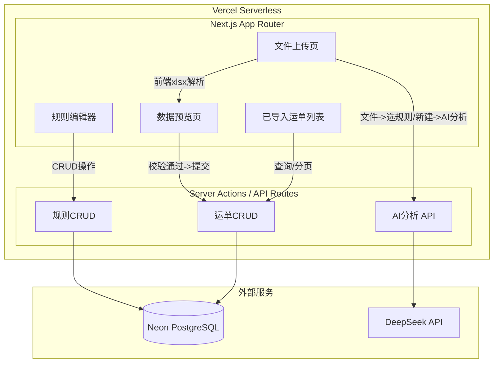
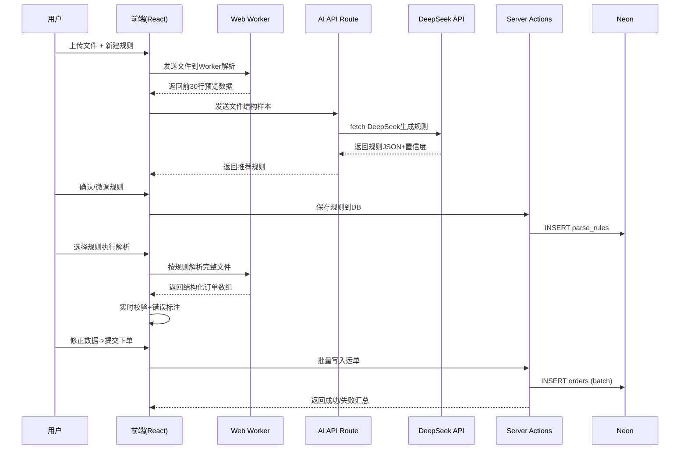

## 产品概述

万能导入 V2 —— 智能多格式批量下单系统，面向物流/快递行业，支持任意格式 Excel/PDF 文件的智能解析与批量下单。系统通过**可配置的通用规则引擎**实现零代码适配新格式，并借由**AI 大模型自动分析文件并生成解析规则**，用户只需确认和微调即可完成导入。

## 核心功能

- **规则引擎管理**：JSON 格式通用规则描述语言，支持创建、编辑、删除、复制规则。规则持久化到 Neon 数据库，支持：头部跳过行、尾部信息提取、跨行聚合、矩阵转置、多Sheet合并、卡片边界识别、复合单元格拆分、默认值注入
- **AI 辅助规则生成**：上传文件后，调用大模型 API 分析文件结构，自动生成推荐规则 JSON，标注推测置信度。用户在规则编辑器中进行试解析预览，确认后保存
- **文件导入与解析**：支持拖拽/点击上传 Excel（.xlsx/.xls）和 PDF 文件。用户手动选择已有规则或新建规则，前端解析引擎按规则执行解析，实时显示进度条
- **数据预览与编辑**：类 Excel 表格展示解析结果，表头固定、横向滚动、单元格点击直接编辑、Tab/回车切换。必填缺失标红、格式错误标红、外部编码重复检测、全部错误一次性列出。支持删除行、新增空行、导出为 .xlsx
- **提交下单**：校验通过的运单数据写入 Neon 数据库，显示上传进度条和成功/失败汇总
- **已导入运单列表**：从数据库读取历史运单，支持按外部编码、收件人、提交时间筛选搜索，分页展示

## 技术选型

| 层级 | 技术 | 说明 |
| --- | --- | --- |
| 框架 | Next.js 15 App Router + TypeScript | 路由基于文件系统，RSC + Server Actions |
| 样式 | Tailwind CSS + shadcn/ui | 原子化CSS + 高质量组件基座 |
| 数据库 | Neon PostgreSQL | @neondatabase/serverless HTTP 驱动 |
| ORM | Drizzle ORM | 轻量、类型安全、完美适配 Serverless |
| Excel解析 | xlsx (SheetJS) 前端解析 | 浏览器端解析，避免大文件上传服务器 |
| PDF解析 | pdfjs-dist 前端解析 | 浏览器端提取文本 |
| 大模型 | DeepSeek API (fetch) | 发送文件前N行样本 + 系统提示，返回规则JSON |
| 虚拟列表 | @tanstack/react-virtual | 1000+ 行数据流畅滚动 |
| 导出 | exceljs | 前端生成 .xlsx 并下载 |


## 系统架构



## 数据流



## 通用解析规则引擎设计

规则以 JSON 存储于数据库，核心结构：

```typescript
interface ParseRule {
  id: string;
  name: string;
  description: string;
  fileType: 'excel' | 'pdf';
  // Excel配置: 头部/尾部跳过、数据区定位
  excel?: { headerRows: number; footerRows: number; dataStartRow: number; skipRows?: number[]; endMarker?: { col: string; val: string } };
  // PDF配置: 表格起止标识
  pdf?: { tableStartMarker: string; tableEndMarker: string; footerStartMarker: string };
  // 字段列映射
  fieldMappings: { fromCol: number; toField: string; aiConfidence?: 'high'|'medium'|'low' }[];
  // 解析模式
  parseMode: 'standard' | 'aggregate' | 'matrix' | 'card' | 'multi-sheet';
  // 跨行聚合: 按外部编码分组，收货信息共享
  aggregate?: { groupByField: string; sharedFields: string[] };
  // 矩阵转置: 门店名作为列头横向排列
  matrix?: { storeHeaderRow: number; storeStartCol: number; storeEndCol: number; fixedColMappings: { fromCol: number; toField: string }[] };
  // 卡片模式: 边界识别
  card?: { boundaryPattern: string; headerRowMappings: { rowOffset: number; mappings: { fromCol: number; toField: string }[] }[]; dataHeaderRowOffset: number };
  // 尾部提取
  footerExtract?: { rowMappings: { rowOffset: number; mappings: { fromCol: number; toField: string }[] }[] };
  // 默认值注入
  defaults?: Record<string, string>;
}
```

## 性能优化

| 优化点 | 策略 |
| --- | --- |
| Excel解析 | Web Worker 加载 xlsx，不阻塞主线程 |
| 虚拟列表 | @tanstack/react-virtual，仅渲染可视区域+overscan |
| 数据库 | @neondatabase/serverless HTTP连接，无连接池泄漏风险 |
| React渲染 | useMemo 缓存列定义，校验错误Map独立管理避免全量渲染 |
| 解析引擎 | 纯同步计算 O(n)，1000行 <1s |


## Neon 数据库表

```sql
CREATE TABLE parse_rules (
  id UUID PRIMARY KEY DEFAULT gen_random_uuid(),
  name VARCHAR(255) NOT NULL,
  description TEXT,
  config JSONB NOT NULL,
  created_at TIMESTAMPTZ DEFAULT now(),
  updated_at TIMESTAMPTZ DEFAULT now()
);

CREATE TABLE orders (
  id UUID PRIMARY KEY DEFAULT gen_random_uuid(),
  external_code VARCHAR(255),
  store_name VARCHAR(255),
  receiver_name VARCHAR(255),
  receiver_phone VARCHAR(50),
  receiver_address TEXT,
  sku_code VARCHAR(255) NOT NULL,
  sku_name VARCHAR(500) NOT NULL,
  sku_quantity NUMERIC NOT NULL,
  sku_spec VARCHAR(500),
  remark TEXT,
  batch_id UUID NOT NULL,
  submitted_at TIMESTAMPTZ DEFAULT now()
);
```

## 目录结构

```
src/
├── app/
│   ├── layout.tsx                    # 根布局 + 导航栏
│   ├── page.tsx                      # 首页 - 文件导入入口
│   ├── globals.css                   # 全局样式 + 鲸天Design Tokens
│   ├── rules/
│   │   ├── page.tsx                  # 规则管理列表页
│   │   ├── [id]/page.tsx             # 规则编辑详情页
│   │   └── new/page.tsx              # 新建规则（含AI生成流程）
│   ├── preview/page.tsx              # 数据预览编辑页
│   ├── orders/page.tsx               # 已导入运单列表页
│   └── api/ai/analyze/route.ts       # AI分析生成规则API
├── components/
│   ├── ui/                           # shadcn/ui 基础组件
│   ├── upload/
│   │   ├── file-upload-zone.tsx      # 拖拽上传区域
│   │   └── rule-selector.tsx         # 规则选择器
│   ├── rule-editor/
│   │   ├── rule-form.tsx             # 规则配置表单
│   │   ├── field-mapping-editor.tsx  # 字段映射编辑器
│   │   ├── ai-rule-panel.tsx         # AI生成规则面板
│   │   └── preview-panel.tsx         # 试解析预览
│   ├── preview/
│   │   ├── data-table.tsx            # 虚拟列表表格
│   │   ├── editable-cell.tsx         # 可编辑单元格
│   │   └── validation-badge.tsx      # 校验错误标记
│   └── shared/
│       ├── progress-bar.tsx          # 进度条
│       ├── toast.tsx                 # Toast通知
│       └── empty-state.tsx           # 空状态
├── lib/
│   ├── db.ts                         # Neon HTTP连接
│   ├── db-schema.ts                  # Drizzle Schema
│   ├── parse-engine.ts               # 解析引擎核心
│   ├── parse-strategies.ts           # 各模式策略实现
│   ├── ai-client.ts                  # 大模型API调用
│   ├── file-reader.ts               # 文件读取(Excel/PDF)
│   ├── validators.ts                 # 字段校验
│   └── utils.ts
└── types/index.ts                    # 全局类型定义
```

## 设计风格

采用与鲸天系统一致的**清爽蓝绿色卡片式设计**，基于 shadcn/ui 组件体系 + Tailwind CSS 定制。

### 主题定位

企业级物流管理系统，专业、高效、可信赖。页面层次分明、信息密度适中。

### 布局结构

- **顶部导航栏**：主色 #0fc6c2 背景，白色文字，左侧项目名"万能导入 V2"，右侧导航（导入下单、规则管理、运单列表）
- **内容区**：最大宽度 1280px 居中，padding 24px，卡片承载功能模块
- **卡片样式**：白色背景、12px 圆角、box-shadow: 0 2px 12px rgba(0,0,0,0.06)、16px 内边距

### 首页（导入入口）

- 上半部分：大号拖拽上传区（虚线边框 2px dashed #0fc6c2、主色淡背景 #e8fafa、居中上传图标+文字引导）
- 下半部分：规则选择区域（搜索下拉框+新建规则按钮并列），解析进度条主色填充

### 规则编辑器

- 基础信息表单（名称、描述、文件类型）+ 字段映射表格（目标字段、来源列号、AI置信度标签）
- 底部：AI生成规则按钮（outline + sparkles图标）+ 试解析预览面板

### 数据预览页

- 全宽表格，表头 sticky，@tanstack/react-virtual 虚拟列表
- 编辑态：蓝色边框高亮，错误态：淡红背景+红色边框+悬浮tooltip
- 顶部工具栏：提交下单（主色）、导出Excel（outline）、新增空行

### 运单列表页

- 筛选栏：外部编码搜索、收件人搜索、时间范围选择器，shadcn Table 分页展示

### 交互细节

- 按钮 loading 态和防重复点击，Toast 通知右上角弹出 3 秒消失
- 拖拽上传高亮反馈，空状态 EmptyState 组件，卡片 hover 上浮 2px

## Agent Extensions

### Skill

- **modern-web-app**：初始化 Next.js App Router + TypeScript + Tailwind CSS + shadcn/ui 项目骨架
- 预期产出：完整的项目目录结构、配置文件、基础 shadcn 组件

- **ui-ux-pro-max**：生成完整的鲸天风格设计系统（色彩方案、字体、间距、组件样式规范）
- 预期产出：Design Tokens、色彩变量、组件样式指南

- **lucide-icons**：下载项目所需图标（upload、file、settings、check、x、sparkles 等）
- 预期产出：SVG/React 图标组件

- **xlsx**：解析 demo Excel 文件结构，验证解析引擎正确性
- 预期产出：各文件的结构分析报告，用于规则引擎开发参考

- **pdf**：解析黔寨寨 PDF 文件，提取文本和表格结构
- 预期产出：PDF 文本内容提取结果，用于验证 PDF 解析模块

- **brainstorming**：在编码前确认规则引擎设计方案的完备性
- 预期产出：规则引擎架构评审结论

- **subagent-driven-development**：拆分为独立子任务并行开发（规则引擎、AI模块、UI组件、数据库）